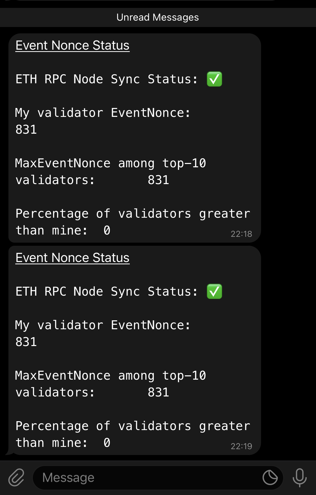

# umee network monitor
Simple tool to check event nonce of validator and compare it with other top-10 validators (with voting power) event nonce and raise an alert(right now its telegram)
Core logic derived from peggo health checker except few modifications detailed below.

Also looks at sync status of eth rpc node and raises an alert.

Alerts about error logs in peggo daemon.

Alerts about new governence proposals.

Features
- Picks top-10 validator nodes by voting power and checks the latest event nonce
- Checks for sync status of eth rpc node
- All requests are done in a concurrent way so as to get quick response
- Heartbeat alert in telegram(configurable in minutes)
- Error alert in telegram if there are nodes with higher event nonce than yours or eth rpc status has gone to catch-up mode.

# Prerequisites
(Always Install all this in non-root account)
**If you need peggo error log alert than this needs to run on same VM as your validator node.
You can always disable peggo alerts and run it on any non-validator machine.**

- Install nvm using this one liner [here](https://github.com/nvm-sh/nvm#installing-and-updating) and 
logout and log back in
- Install nodejs and npm using nvm  
  `nvm install 16`  
  `nvm use 16`
- Check version using `node -v` and it should be > 16
- Obtain telegram bot id and chat id using steps below.
- Create .env file by renaming env file and updating property values accordingly.

1. To create a free **Telegram account**, download the [app for Android / iPhone](https://telegram.org) and sign up using your phone number.
2. To create a **Telegram bot**, add [@BotFather](https://telegram.me/BotFather) on Telegram, press Start, and follow the below steps:
    1. Send a `/newbot` command and fill in the requested details, including a bot name and username.
    2. Take a note of the API token, which looks something like `123456:ABC-DEF1234ghIkl-zyx57W2v1u123ew11`.
    3. Access the link `t.me/<username>` to your new bot given by BotFather and press Start.
    4. Access the link `api.telegram.org/bot<token>/getUpdates`, replacing `<token>` with the bot's API token. This gives a list of the bot's activity, including messages sent to the bot.
    5. The result section should contain at least one message, due to us pressing the Start button. If not, sending a `/start` command to the bot should do the trick. Take a note of the `"id"` number in the `"chat"` section of this message.
    6. One bot is enough for now, but you can repeat these steps to create more bots.

**At the end, you should have:**
1. A Telegram account
2. A Telegram bot *(at least one)*
3. The Telegram bot's API token *(at least one)*
4. The chat ID of your chat with the bot *(at least one)*

# Configuration
1. MY_ORCHESTRATOR_ADDRESS="this is your orchestrator wallet address starting with umee1"
2. UMEE_RPC_URL="https://api.blue.main.network.umee.cc/"
3. TELEGRAM_BOT_TOKEN="Telegram bot token from above step"
4. TELEGRAM_CHAT_ID="Telegram chat id from above step"
5. RUN_INTERVAL_IN_MINS="Frequency of running the event nonce and eth sync flow in mins. Ex: 10"
6. HEARTBEAT_INTERVAL_IN_MINS="Frequency of running the heartbeat flow in mins. Ex: 10"
7. ETH_RPC_ENDPOINT="eth rpc endpoint. Ex: http://x.x.x.x:8545"
8. NEW_GOV_PROPOSALS_INTERVAL_IN_MINS="Frequency of running the governence flow in mins. Ex: 10"
9. PEGGO_ERROR_LOGS_MONITOR_ENABLED="true/false"(change it to true to monitor peggo logs every min for any error
and send alert)


# Running
Run the following commands using tools like screen,tmux or create a service file if you prefer that.
Clone the github repo.
After that run the following commands
- `npm install`
- `node index.js`

**Service file**

If you are interested in creating service file,below is an example.
For simplicity, root user is used but you should change it to your own user.Also change the path in 
WorkingDirectory as well as parameter for ExecStart based on where you checked out from GIT

```shell
tee $HOME/umeemonitor.service > /dev/null <<EOF
[Unit]
Description=UMEEMONITOR
After=network.target
[Service]
Type=simple
User=root
WorkingDirectory=/root/umeemonitor
ExecStart=$(which node) /root/umeemonitor/index.js
Restart=on-failure
RestartSec=10
[Install]
WantedBy=multi-user.target
EOF
```

```shell
sudo mv $HOME/umeemonitor.service /etc/systemd/system/
sudo systemctl daemon-reload
sudo systemctl enable umeemonitor
sudo systemctl restart umeemonitor && journalctl -u umeemonitor -f -o cat
```

**Preview of Alert on Telegram**

